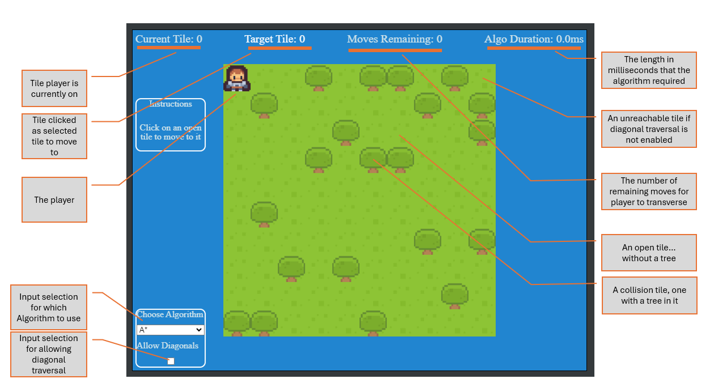
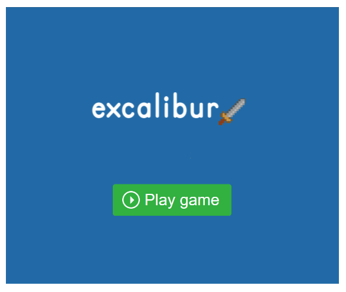

###### Readme top

<br />
<div align="center">
  <a href="http:\\excaliburjs.com">
    
  </a>

  <h3 align="center">Excalibur Demo (Tilemaps, Peasy-UI HUD, and Pathfinding)</h3>

  <p align="center">
    An small project that highlights the use of tilemaps and pathfinding, and demonstrates inegration of peasy-UI
    <br />
    
  </p>
</div>

<!-- TABLE OF CONTENTS -->
<details>
  <summary>Table of Contents</summary>
  <ol>
    <li>
      <a href="#about-the-project">About The Project</a>
      <ul>
        <li><a href="#built-with">Built With</a></li>
      </ul>
    </li>
    <li>
      <a href="#getting-started">Getting Started</a>
    </li>
    <li>
      <a href="#demo-ui">Demo UI</a>
    </li>
    <li><a href="#usage">Usage</a>
      <ul>
        <li><a href="#usage-of-excalibur-concepts">Excalibur Concepts</a>
        <ul>
            <li><a href="#loader">Loader</a></li>
            <li><a href="#actor">Actor</a></li>
            <li><a href="#tilemap">Tilemap</a></li>
          </ul>
        </li >
        <li><a href="#usage-of-peasy-ui">Peasy-UI</a></li>
        <li><a href="#usage-of-the-graph-module">Graph module</a>
          <ul>
            <li><a href="#manual">Manual</a></li>
            <li><a href="#importing-tilemap">Tilemap</a></li>
          </ul>
        </li>
        <li><a href="#usage-of-the-a-star-module">A* module</a>
          <ul>
            <li><a href="#importing-tilemap-for-a-star">Tilemap</a></li>
          </ul>
        </li>
      </ul>
    </li>
    <li><a href="#contact">Contact</a></li>
    <li><a href="#acknowledgments">Acknowledgments</a></li>
  </ol>
</details>

<!-- ABOUT THE PROJECT -->

## About The Project

This project is a small 'game' that implements some key ideas and concepts:

- Tilemaps
- Loader bringing in Sprites and Spritesheets
- Click Events on the tilemap
- Pathfinding model utilizing Dijkstra's Algorithm
- Pathfinding via A\* Algorithm
- implements Peasy-UI for a HUD layer above the game that has dynamic data binding

<p align="right">(<a href="#readme-top">back to top</a>)</p>

### Built With

- [Excalibur](https://excaliburjs.com/)
- [Peasy-UI](https://github.com/peasy-lib/peasy-lib/tree/main/packages/peasy-ui)

<p align="right">(<a href="#readme-top">back to top</a>)</p>

<!-- GETTING STARTED -->

## Getting Started

To run the demo, you can clone the repo from GitHub.

```sh
npm install
npm run dev
```

## Demo UI



<!-- USAGE EXAMPLES -->

## Usage of Excalibur Concepts

### Loader

The Loader feature of excalibur gives a great way to preload any/all assets, and also allowing for the audio context to be granted in
the browser via a user gesture when the `Play` button is pressed

```ts
// import library
import { Loader, Engine } from "excalibur";
import { Resources } from "./resources";

// create your game
const game = new Engine({
  //... engine config details here
});

// create instance of Loader
const loader = new Loader();

// iterate over Resources and add assignments into loader
for (const resource of Object.values(Resources)) loader.addResource(resource);

// launch game using the loader
await game.start(loader);
```

this will give you this entroy screen after assets loaded



### Actor

This project uses a separate class for managing the primary actor, which extends the Actor class.

This allows for us to customize and add methods and properties to the player.

Here, we are adding the playerActionBuffer and playerActionStatus properties.

Also we can overload and replace the \_postUpdate method, which gets executed in the game loop of Excalibur.

We also are adding a new method: moveToTile

```ts
class Player extends Actor {
  playerActionBuffer: any = [];
  playerActionStatus = "idle";

  constructor(options: any) {
    super(options);
    this.graphics.use(Resources.plrImage.toSprite());
  }

  _postupdate(engine: Engine<any>, delta: number): void {
    if (this.playerActionBuffer.length > 0) {
      if (this.playerActionStatus == "idle") {
        this.playerActionStatus = "moving";

        // monitor player move completion from
        // game events
        game.events.on("playerMoveComplete", () => {
          // this updates the HUD with the next tile data
          model.currentTileIndex = nextTile;
          this.playerActionStatus = "idle";
        });

        // get next tile off action buffer and moveTo
        const nextTile = this.playerActionBuffer.shift();
        this.moveToTile(nextTile);
      }
    } else {
      // action buffer empty, reset
      this.playerActionStatus = "idle";
    }
  }
  moveToTile(node: number) {
    //convert node, which is flat array index into x and y
    let x = node % 10;
    let y = Math.floor(node / 10);
    //get vector between player and tile
    let target = new Vector(x * 16 + 8, y * 16 + 8);
    player.actions.easeTo(target, 500, EasingFunctions.EaseInOutCubic);
    //delay 500 ms and then emit event for end of move
    setTimeout(() => {
      model.movesRemaining--; // this updates HUD with moves remaining data
      game.events.emit("playerMoveComplete");
    }, 500);
  }
}
```

### Tilemap

The tilemap feature of excalibur let's you easily add/manipulate a spritesheet or static images and use them in a structured grid

```ts
import { Tilemap } from "excalibur";
import { Resources, rlSS } from "./resources";

// Create a tilemap
const tilemap = new TileMap({
  rows: 10,
  columns: 10,
  tileWidth: 16,
  tileHeight: 16,
});

// loop through tilemap cells
let tileIndex = 0;
for (let tile of tilemap.tiles) {
  // get sprite
  const sprite = rlSS.getSprite(tiles[tileIndex].sprite[0], tiles[tileIndex].sprite[1]);
  if (sprite) {
    // all spots gets grass, then if tree, gets tree
    tile.addGraphic(rlSS.getSprite(tiles[0].sprite[0], tiles[0].sprite[1]));
    if (tiles[tileIndex] instanceof Tree) {
      tile.addGraphic(sprite);
    }
  }
  tileIndex++;
}

//... some more code

await game.start(loader);
game.add(tilemap); // add the tilemap to the game/scene
```

## Usage of Peasy-UI

### quick getting started

a UI object from peasy uses a data model object and a string template literal to parse and render. the UI object owns this template, so
it monitors for changes in the data model, and using the data bindings in the template will re-render whatever is bound in the
template.

### brief example

```ts
import { UI } from "@peasy-lib/peasy-ui";

const model = {
  myName: "Mookie",
};

const template = `
<div>
    <div>Hello, my name is \${myName}</div>
</div>
`;

await UI.create(document.body, model, template).attached;
```

the async create method will gatekeep until Peasy completely renders the template, then you can proceed. Then to manipulate what's
rendered, just change the data model.

```ts
model.myName = "Sarah";
```

and it will change what's rendered. Please refer to the peasy-ui documentation for ALL the different bindings and features, there's
quite a bit.

<p align="right">(<a href="#readme-top">back to top</a>)</p>

## Usage of the Graph Module

To use the Graph.ts module included with this project, you can build your 'graph' manually, or import a tilemap object and let the
module parse it itself.

### Manual


To manually load this example graph, we need to :

1 create an instance of the graph class:

```ts
import { AdjacencyList } from "./graphs";
const myGraph = new AdjacencyList();
```

2 load each node using myGraph.addNode();

```ts
myGraph.addNode({ name: "a" });
myGraph.addNode({ name: "b" });
myGraph.addNode({ name: "c" });
myGraph.addNode({ name: "d" });
myGraph.addNode({ name: "e" });
myGraph.addNode({ name: "f" });
```

3 manually load the edge relationship with distance values

```ts
myGraph.addEdge({ name: "ab", from: myGraph.nodes.get("a")!, to: myGraph.nodes.get("b")!, value: 10 }, true);
myGraph.addEdge({ name: "bf", from: myGraph.nodes.get("b")!, to: myGraph.nodes.get("f")!, value: 10 }, true);
myGraph.addEdge({ name: "ac", from: myGraph.nodes.get("a")!, to: myGraph.nodes.get("c")!, value: 5 }, true);
myGraph.addEdge({ name: "cd", from: myGraph.nodes.get("c")!, to: myGraph.nodes.get("d")!, value: 15 }, true);
myGraph.addEdge({ name: "de", from: myGraph.nodes.get("d")!, to: myGraph.nodes.get("e")!, value: 3 }, true);
myGraph.addEdge({ name: "be", from: myGraph.nodes.get("b")!, to: myGraph.nodes.get("e")!, value: 8 }, true);
```

4 you are now free to run Depth First Search (dfs), Breadth First Search(bfs), Dijkstra's Algorithm, and find shortest path between
nodes

\*\* dev's note, the `true` that's passed as last parameter automatically creates the reverse path to make it bi-directional

<p align="right">(<a href="#readme-top">back to top</a>)</p>

### Importing Tilemap


If you wanted to load this example tilemap on the left in order to 'create' the graph on the right...

1 create an instance of the graph class:

```ts
import { AdjacencyList, GraphTileMap } from "./graphs";
let tilemapAdjacencyList = new AdjacencyList();
```

2 using a GraphTileMap object, create your tilemap config object

```ts
let tilemapAdjacencyList = new AdjacencyList();
let tilemap: GraphTileMap = {
  name: "tilemap",
  tiles: [],
  rows: 3,
  cols: 4,
};
```

3 load up your tiles with tile objects

example tile object

```ts
class Grass extends Tile {
  constructor() {
    super();
    this.name = "grass";
    this.collider = false;
  }
}
```

the graph parser simply consumes the collider property, and uses it to create the edge connections automatically, so if a tile is a
collider, and its true, then the 'node' won't be created, and it will influence/manipulate the graph design. This is visually
represented in the above image, where the 'wall' tiles do not show up in the graph.

```ts
tilemap.tiles = [
  new Grass(),
  new Grass(),
  new Grass(),
  new Wall(),
  new Grass(),
  new Wall(),
  new Grass(),
  new Grass(),
  new Grass(),
  new Grass(),
  new Grass(),
  new Grass(),
];
```

4 Pass the tilemap to the Graph, and it will create your nodes and edges automatically, there is a 2nd parameter associated with this,
if you want diagonal tiles to be included in the relationships and edges created, pass a true as the second parameter.

```ts
tilemapAdjacencyList.addTileMap(tilemap, true); // 2nd parameter defaults to false
```

<p align="right">(<a href="#readme-top">back to top</a>)</p>

## Usage of the A star module

The A star module simply imports a tilemap object, parses it, then exposes a method `astar()` that returns an array of nodes.

### Importing Tilemap For A Star

The A\* module in this package is tailored to use with the Excalibur Tilemap resource. You can create your TileMap object, set up the
tiles, then pass it to the ExcaliburAstar() method.

```ts
// Create a tilemap
const tilemap = new TileMap({
  rows: 10,
  columns: 10,
  tileWidth: 16,
  tileHeight: 16,
});

// create astar instance
let myGraph = new ExcaliburAstar(tilemap);
```

After the tilemap is parsed, as needed, you can call the astar() method, and the shortest path will be returned between the starting
node and ending node. TAKE NOTE\*\*\*\* path will NOT include the starting path. If you want to traverse paths using diagonals, then
pass a true to the final paramater, which defaults to false.

```ts
path = myGraph.astar(myGraph.getNodeByIndex(playerTileIndex), myGraph.getNodeByIndex(targetTileIndex), letDiag);
```

<!-- CONTACT -->

## Contact

Justin Young - [@jyoung424242 (Twitter)](https://twitter.com/your_username) - [Mookie4242 (itch.io)](https://mookie4242.itch.io/)

Project Link: [GitHub Repo: exGraph](https://github.com/jyoung4242/exGraph)

<p align="right">(<a href="#readme-top">back to top</a>)</p>

<!-- ACKNOWLEDGMENTS -->

## Acknowledgments

Special thanks to two great communities that are always available to jump in help, and inspire little projects like these!!!! Also, if
you don't know Kenney.nl, you need to become familiar with their work, its top-notch!

- [Excalibur Discord](https://discord.gg/yYY6hGVTf5)
- [Game Dev Shift Discord](https://discord.gg/BZMcuR3FBD)
- [Kenney](https://Kenney.nl)

<p align="right">(<a href="#readme-top">back to top</a>)</p>
